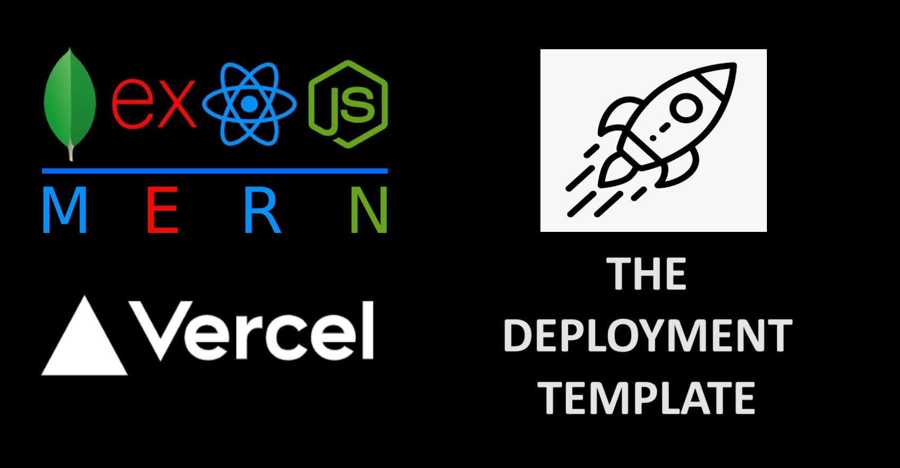

## VERCEL DEPLOYMENT OF ENTIRE MERN APP



> ***⚠️ This template, unlike most Express backends, uses MJS for better code readability.***
> ***⚠️ Unlike most react frontend, this template, uses vite insted of create-react-app.***
## **VERCEL DEPLOYMENT**
TO DEPLOY BUILD AND DEPLOY THE ENTIRE PROJECT IN WINDOWS, MAC or LINUX OS USE COMMAND
```
npm run deploy
```

## Making new MERN app with this template

**Note :** Nodejs should be installed in the system prior to use of this template

Installation and usage for 1st time
```
git clone https://github.com/Pranay-Pal/Vercel-Deployment-Template-MERN.git
npm ci
npm run build
``` 

## How does this work ?


**index.html**, **/src** & **/public** --> entry to react app

**index.js** & **/api** --> express app and backend

**/dist** --> compiled frontend

#### **Frontend**
- The src folder is supposed to be used for development of the entire react application and all frontend code.
- Modification of index.html in root folder can also be done if required. 
#### **Backend**
- The index.js is the entry point to the backend server. In / it serves the frontend build present in dist directory as static files on get request.
- all parts of the backend api (controllers, models, routes, etc) is supposed to be built inside api directory and is supposed to served from /apis .

***To start the backend use:*** 
```
npm run start
```
***To start the frontend use:*** 
```
npm run dev
```
- For building the react app use  ``` npm run build ``` it will be built in the dist directory.

## Download Template

Github : **[Visit](https://github.com/Pranay-Pal/Vercel-Deployment-Template-MERN)**

-- or --

clone 
``` 
git clone https://github.com/Pranay-Pal/Vercel-Deployment-Template-MERN.git 
```
.

.

.

# --- made in 🇮🇳 by Pranay with ❤️
For issues let me know at <pny1cl2125@gmail.com>
